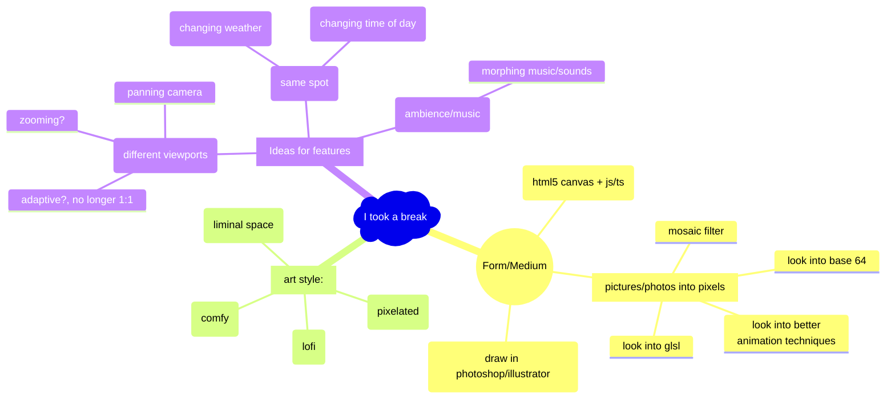

# Ideas
### <ins>Brainstorming/Ideas:

Window bars in front

___

### <ins>Mind-Map:

```mermaid
mindmap
    )I took a break(

        ((Form/Medium))
            (html5 canvas + js/ts)
            (draw in photoshop/illustrator)
            [pictures/photos into pixels]
                mosaic filter
                look into base 64
                look into glsl
                look into better <br> animation techniques

        [art style:] 
            (pixelated)
            (lofi)
            (comfy)
            (liminal space)

        [Ideas for features]
            (different viewports)
                adaptive?, no longer 1:1
                zooming?
                panning camera
            
            (ambience/music)
                morphing music/sounds

            (same spot)
                (changing weather)
                (changing time of day)

```
___