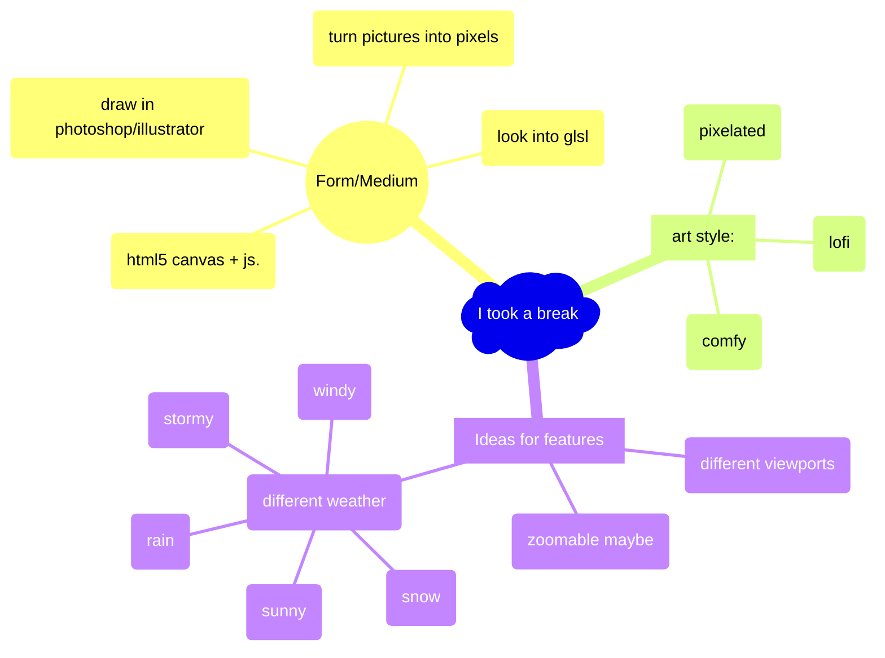

# Hausaufgabe Digital Ideation 2024
### Thema: "I took a break"
___

![Aufgabe] (docs/pdf/hausaufgabe.png)

### <ins>Mind-Map:</ins>

```mermaid
mindmap
    )I took a break(

        ((Form/Medium))
            (html5 canvas + js.)
            (draw in photoshop/illustrator)
            (turn pictures into pixels)
            (look into glsl)

        [art style:] 
            (pixelated)
            (lofi)
            (comfy)

        [Ideas for features]
            (zoomable maybe)
            (different viewports)
            (different weather)
                (rain)
                (snow)
                (sunny)
                (windy)
                (stormy)


```
