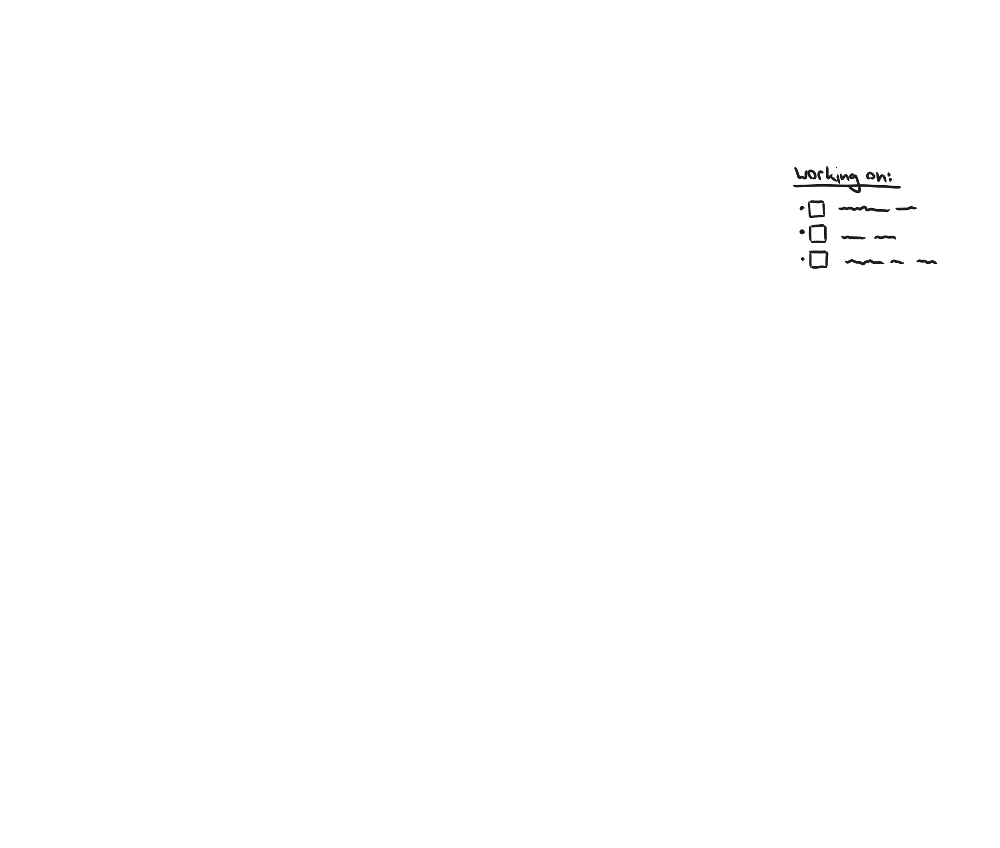

# Hausaufgabe Digital Ideation 2024
___

### Idea
- App/tool that helps with stress and focus while working, and that helps with remembering to take breaks. Helps to focus with nice environments and sounds, and reminds you of a break when a certain amount of time has passed or when youre starting to get tired.

### Mockup

___

___

### Concept outline (text)

#### <ins>Idea

- **Virtual window**
  - central "theme" that ties it together

- **For me specifically**
  - (people with adhd)
  - time blindness (?)

- **To space out and focus, and take breaks**

#### <ins>Function

- **Background atmosphere/environment while working**
  - Calm, ambient, nostalgic

- **Passive break**
  - relaxing background noises  
  - not too distracting
  - lets you sink in work without checking the clock or thinking about having to take a break
  - Adapts the sounds to the "mood"/stress level/noise around
  - gives the feeling that youre working somewhere more relaxing

- **Active break**
  - more visual
  - "space out" in your thoughts
  - write down notes   

- **Productivity tools/helpful stuff to take breaks (?)**
  - notes/voice memo to write down/record before break, and get reminded after break 
  - sense when you need a break (or reminds you after a set amount of time)
    - Variable heart rate
    - puls etc
    - microphone (breathing rate, chair moving, other noises)

#### <ins>Design 

- **Scenes**
  - Different environments, weather, season, time of day

- **Sounds**
  - Background noise/"brown noise" to fit with scene and to relax

- **UI/UX**
  - Choose scenery, time of day, weather, season
  - Choose break "interval" or "threshhold"
  - Write down notes --> to remember where you were

### To-Do:

> #### PDF:
> - [ ] **Visually depict break**
>    - [ ] Image/Drawing of break --> window trace thing 
>
> 
>
>- [ ] **Concept**
>   - [x] Figure out a theme --> Work/Break balance, mix of both
>   - [ ] Research how concepts look
>   - [ ] Figure out what i need in the concept:
>     - [x] mockup of screen 
>     - [ ] 200 words of explanation 
>     - [ ] brief overview of idea, mechanics, design philosophy etc 
>     - [ ] explanation of technical details (sensors or data etc)
>     - [ ] Ideas for future expansion (?)
>   
>
>    - [ ] Figure out how to implement hint:
>      - windowframe(?)
>      - Data, graphs
>      - How it checks if you need a break
>      - Sensors
>
>   - [ ] Visuals
>     - [x] Sketch of idea
>     - [x] Mockup of final screen (couple of scenes, buttons etc)
>     - [x] Mindmap of ideas

### Concept 200 words:
        200 words

### Mindmap

___

#### To-Do (if time):
- [ ] Shorten portfolio (to 20 pages)
    - [ ] Shorten Sketches
    - [ ] Shorten Animations
- [ ] More unified project description (time, project, title etc)
___

 

### <ins>TL:DR Aufgabenstellung:

#### Thema:    "<ins>I took a break</ins>" 

#### - Step 1: 
  - portray the "break" visually as an image --> study it, make it visible, "translate" graphically --> work out the specific attributes/features
  - (probably sketches/mockups etc) --> [[AI-PS/facade sketch.ai]] & [[AI-PS/facade new.psd]] 

#### - Step 2: 
  - Digital "thing" that helps me and others to utilize the regenerative qualities of my break
  - **Concept only**, mechanics, dynamics and aesthetics. Lots of images (rough if descriptive enough, more detailed if needed)
  - The more images the better ("Sie bewerben sich für Design, zeigen Sie uns, was Sie als (visual!) Designer zu leisten vermögen.") 

#### - Form:
  - pdf, **max 4 pages** (landscape) & max 20mb
  - **max 200 words** + images
  - presentation of the concept
    - covers relevant points for the application, no redundancy and no contradictions, thin & unmistakeably clear and concise (?)
    - original (with personal "signature")
    - quality & visuals: with care, convincing, user friendly and without technical problems --> covers the whole thing and individual elements
    - language: understandable, precise, stylistically "safe" and without mistakes

 

### <ins>Aufgabenstellung

#### 1. Thema
Das diesjährige Thema lautet: "I took a break".
"Also, man kann sich in einen Sessel setzen – ich sitze furchtbar gern im Sessel und döse – und davon schweben. Manchmal, vor allem wenn ich einschlafe oder mit geschlossenen Augen dasitze … schwebe ich durch diesen speziellen Raum, in dem die Bilder von selbst auftauchen, ohne mein Zutun. Sobald ich darüber nachdenke, ist es vorbei." David Lynch, in: Chris Rodley (Hrsg.), Lynch über Lynch, 2006, S. 30.
Was tun Sie, um zu regenerieren, sich eine Auszeit zu nehmen? "Breaks" dauern kurz oder länger, sie brauchen meistens einen geschützten Ort, finden nachts oder tagsüber statt, können gemessen werden, sind manchmal zu viel oder zu wenig, sind Wach- oder Schlafzustände oder etwas dazwischen.

- a.	Stellen Sie uns in einem ersten Schritt einen Ihrer "breaks" in Bildern vor. **Studieren Sie ihn, machen Sie ihn sichtbar, übersetzen Sie ihn grafisch**, wobei Sie seine **spezifischen Eigenschaften herausarbeiten** und in **visueller Form nachvollziehbar machen**.

- b.	Entwerfen Sie dann ausgehende von diesen Eigenschaften ein Konzept
    - i.	ENTWEDER für ein Game, das in die Welt Ihres "break" entführt,
    - ii.	ODER für eine digitale Anwendung, die Sie und andere darin unterstützt, die **regenerativen Qualitäten Ihrer Art von “break” optimal zu nutzen oder zu trainieren**.
 

#### 2. Form
PDF (≤ 20 MB), Querformat, maximal vier Seiten. Die Präsentation Ihres "break" und Ihres Konzeptes
soll in Wort (≤ 200 Wörter) und Bild so dargestellt werden, dass sich der Jury Ihr "break" sowie Ihr Konzept schnell und klar erschliessen. Ihr Konzept wird bei der Beurteilung stark gewichtet, widmen Sie ihm daher genügend Zeit und Raum. Folgende Kriterien müssen beurteilbar werden:
1.	Konzept. Ein gutes Konzept deckt alle Punkte ab, die für das Spiel oder die Anwendung relevant sind, und enthält keine Widersprüche und Redundanzen. Es ist schlank, nachvollziehbar und zeigt unmissverständlich, worum es geht.
2.	Originalität. Einer originellen Idee sieht man Ihre persönliche Handschrift an. Sie ähnelt anderen Lösungsvorschlägen für die gleiche Aufgabe nur gering.
3.	Produktionsqualität und Gestaltung. Sorgfältig umgesetzt, überzeugend gestaltet, leserfreundlich, ohne technische Mängel. Bezieht sich auf die Gestaltung des Ganzen wie der einzelnen Elemente.
4.	Sprache. Verständliche, präzise, stilistisch sichere und sprachlich fehlerfreie Erläuterungen.
 

#### 3.	Hint
Während der Bearbeitungszeit schicken wir Ihnen einen Hinweis ("hint") zur Konkretisierung zu. Sie sind dann aufgefordert, Ihre bisherige Arbeit möglichst sinnvoll und überzeugend auf diesen "hint" neu auszurichten.
Dieses Element sollen Sie möglichst gut in Ihre bisherige Arbeit integrieren, das heisst, es soll an Ihrem Arbeitsprozess erkennbar sein, wie Sie die Aufgabe **<ins>vor** und **<ins>nach** dem Erhalt des Hints bearbeitet haben.
Ihr Element ist: 

    

<!--  -->

#### Clarification
Für ein Endprodukt fehlt die Zeit, also ist es das Konzept.
Was beinhaltet ein Konzept? Bei einem Game sind es Mechanik, Dynamik und Ästhetik. Es braucht also Bilder, viele Bilder. Sie können rough bleiben, wenn so aussagekräftig genug, müssen detaillierter sein, wenn z.B. der Look gezeigt werden soll. Sie haben eine Begrenzung der Textmenge im Aufgabenbeschrieb. Je mehr Sie über Bilder verstehbar machen können, desto weniger müssen Sie schreiben (und die Jury lesen). Sie bewerben sich für Design, zeigen Sie uns, was Sie als (visual!) Designer zu leisten vermögen.