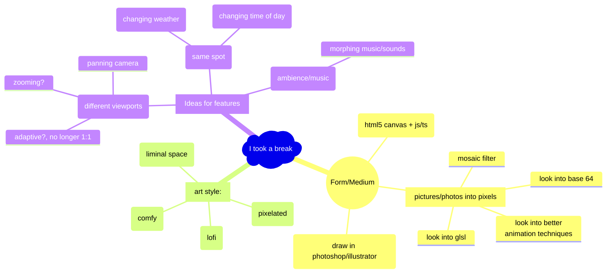

# Hausaufgabe Digital Ideation 2024

### <ins>TL:DR Aufgabenstellung:

#### - Thema: 
  - "I took a break"

#### - Step 1: 
  - portray the "break" visually as an image --> study it, make it visible, "translate" graphically --> work out the specific attributes/features

#### - Step 2: 
  - Digital "thing" that helps me and others to utilize the regenerative qualities of my break

#### - Form:
  - pdf, **max 4 pages** (landscape) & max 20mb
  - **max 200 words** + images
  - presentation of the concept
    - covers relevant points for the application, no redundancy and no contradictions, thin & unmistakeably clear and concise (?)
    - original (with personal "signature")
    - quality & visuals: with care, convincing, user friendly and without technical problems --> covers the whole thing and individual elements
    - language: understandable, precise, stylistically "safe" and without mistakes

___

### <ins>Brainstorming/Ideas:

___

### <ins>Mind-Map:

___

### <ins>Aufgabenstellung

#### 1. Thema
Das diesjährige Thema lautet: "I took a break".
"Also, man kann sich in einen Sessel setzen – ich sitze furchtbar gern im Sessel und döse – und davon schweben. Manchmal, vor allem wenn ich einschlafe oder mit geschlossenen Augen dasitze … schwebe ich durch diesen speziellen Raum, in dem die Bilder von selbst auftauchen, ohne mein Zutun. Sobald ich darüber nachdenke, ist es vorbei." David Lynch, in: Chris Rodley (Hrsg.), Lynch über Lynch, 2006, S. 30.
Was tun Sie, um zu regenerieren, sich eine Auszeit zu nehmen? "Breaks" dauern kurz oder länger, sie brauchen meistens einen geschützten Ort, finden nachts oder tagsüber statt, können gemessen werden, sind manchmal zu viel oder zu wenig, sind Wach- oder Schlafzustände oder etwas dazwischen.
- a.	Stellen Sie uns in einem ersten Schritt einen Ihrer "breaks" in Bildern vor. Studieren Sie ihn, machen Sie ihn sichtbar, übersetzen Sie ihn grafisch, wobei Sie seine spezifischen Eigenschaften herausarbeiten und in visueller Form nachvollziehbar machen.
- b.	Entwerfen Sie dann ausgehende von diesen Eigenschaften ein Konzept
    - i.	ENTWEDER für ein Game, das in die Welt Ihres "break" entführt,
    - ii.	ODER für eine digitale Anwendung, die Sie und andere darin unterstützt, die regenerativen Qualitäten Ihrer Art von “break” optimal zu nutzen oder zu trainieren.
 

#### 2. Form
PDF (≤ 20 MB), Querformat, maximal vier Seiten. Die Präsentation Ihres "break" und Ihres Konzeptes
soll in Wort (≤ 200 Wörter) und Bild so dargestellt werden, dass sich der Jury Ihr "break" sowie Ihr Konzept schnell und klar erschliessen. Ihr Konzept wird bei der Beurteilung stark gewichtet, widmen Sie ihm daher genügend Zeit und Raum. Folgende Kriterien müssen beurteilbar werden:
1.	Konzept. Ein gutes Konzept deckt alle Punkte ab, die für das Spiel oder die Anwendung relevant sind, und enthält keine Widersprüche und Redundanzen. Es ist schlank, nachvollziehbar und zeigt unmissverständlich, worum es geht.
2.	Originalität. Einer originellen Idee sieht man Ihre persönliche Handschrift an. Sie ähnelt anderen Lösungsvorschlägen für die gleiche Aufgabe nur gering.
3.	Produktionsqualität und Gestaltung. Sorgfältig umgesetzt, überzeugend gestaltet, leserfreundlich, ohne technische Mängel. Bezieht sich auf die Gestaltung des Ganzen wie der einzelnen Elemente.
4.	Sprache. Verständliche, präzise, stilistisch sichere und sprachlich fehlerfreie Erläuterungen.
 

#### 3.	Hint
Während der Bearbeitungszeit schicken wir Ihnen einen Hinweis ("hint") zur Konkretisierung zu. Sie sind dann aufgefordert, Ihre bisherige Arbeit möglichst sinnvoll und überzeugend auf diesen "hint" neu auszurichten.
 
